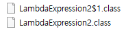

# Lambda Expression

## Lambda Expression?
**람다식**, 또는 **람다함수** 라고 불리는 이것은 여러 프로그래밍 언어에서 사용되는 개념으로 익명 함수(Anonymous functions)을 지칭하는 용어이다.
여기서 말하는 익명 함수란 앞서 말한 [함수](./04-functional-programming.ko-KR.md#functional-programming-1)라는 것이 이름 없는 함수로 표현되는 것이다.
함수란 보통 ***반환 타입, 함수명, 매개 변수, 함수 내용*** 이렇게 구성 되어있는 것이 가장 일반적이다. 그러나 람다식은 ***매개 변수, 함수 내용*** 이렇게 두 가지로만 구성이 되어있다.

## 장점
* 효율적인 람다 함수의 사용을 통하여 불필요한 루프문의 삭제가 가능하며, 한 번 선언된 람다 함수를 재활용할 수 있는 여지가 커진다. 따라서 코드가 간결해지는 장점이 있다.
* 지연 연산을 지원하는 방식을 통하여 효율적인 퍼포먼스를 기대할 수 있다. 이 경우 메모리 상의 효율성 및 불필요한 연산의 배제가 가능하다는 장점이 있다.

## 단점
* Collection이나, Array의 모든 원소를 전부 순회하는 경우 일반 loop문 보다 람다식이 조금 느릴 수 밖에 없다.
* 람다식을 너무 남발하여 사용하게되면 오히려 코드를 이해하기 어려울 수도 있다.

## Lambda Expression in Java
먼저 Java 에서의 람다식에서 가장 중요한 점은 람다식에서 사용되는 인터페이스는 무조건 @FunctionalInterface 이어야 한다는 것이다. FunctionalInterface가 아니면 람다식 문법을 사용할 수 없다.

그럼 Consumer 인터페이스를 이용해 람다식을 사용하지 않고, 입력된 값을 출력하는 함수를 하나 작성해 보자.
그런 경우는 일반 객체 생성하는 것과 비슷하게 `new` 을 이용하여 익명 클래스로 객체 생성 후, 필수 메소드인 `accept` 를 Overriding 할 것이다.
```java
// Lambda 을 이용하지 않고 String 을 출력하는 함수 생성
Consumer<String> f1 = new Consumer<String>() {
	@Override
	public void accept(String p) {
		System.out.println(p);
	}
};
```

이번엔 람다식을 이용해보자. Java 에서의 람다식도 마찬가지로 ***매개 변수, 함수 내용*** 이렇게 두 가지로만 구성된다. 매개 변수는 소괄호을 이용해 감싸고, 함수 내용은 중괄호를 이용해 감싼다.
그리고 매개 변수 부분과, 함수 내용을 구분하기 위해 화살표 모양의 기호(->)를 사용한다.
```java
// Lambda 을 이용해 String 을 출력하는 함수 생성
Consumer<String> f2 = (String p) -> {
	System.out.println(p);
};
```

또한 람다식을 추가적으로 더 간결하게 작성할 수 도 있다. 먼저 코드 블록을 이용하지 않고, 한 줄로만 작성할 경우 중괄호를 생략해도 무관하다.
```java
// Lambda 을 이용해 String 을 출력하는 함수 생성 (중괄호 생략)
Consumer<String> f3 = (String p) -> System.out.println(p);
```

만약 람다식에 사용된 FunctionalInterface 의 메소드가 반환 타입이 있는 경우
이렇게 코드 블록을 사용하지 않고 한 줄로 입력하면 그 값이 바로 반환 값이 된다. (코드 블록을 쓰면 당연히 return 을 써야한다.)
```java
// Lambda 을 이용해 숫자가 짝수인지 확인하는 함수 생성
Predicate<Integer> f4 = (Integer p) -> p % 2 == 0;
```

그리고 람다식의 매개 변수 부분에서 매개 변수의 데이터 타입을 생략해도 무관하다.
```java
// Lambda 을 이용해 숫자가 짝수인지 확인하는 함수 생성 (매개 변수 데이터 타입 생략)
Predicate<Integer> f5 = (p) -> p % 2 == 0;
```

마지막으로 매개 변수가 한 개일 때는 매개 변수를 감싸고 있는 소괄호를 생략해도 무관하다.
```java
// Lambda 을 이용해 숫자가 짝수인지 확인하는 함수 생성 (매개 변수 소괄호 생략)
Predicate<Integer> f6 = p -> p % 2 == 0;
```

*[소스코드 - LambdaExpression.java](../src/content06/LambdaExpression.java)*

## 익명 클래스와 람다식의 차이점

###this
클래스 내부에서 선언되는 익명 클래스의 this 는 익명클래스 자기 자신을 가리킨다.
반면, 람다식에서 this 는 람다식을 감싸고 있는 클래스를 기리키게 된다.

따라서 만약 람다식 선언시 해당 변수가 정적 변수라면 동적 영역의 this는 당연히 참조를 할 수 없다.
하지만 익명 클래스로 정적 변수 선언시 this는 익명 클래스 자기 자신이기 때문에 상관이 없다.

```java
// 익명 클래스의 this
Consumer<String> f1 = new Consumer<String>() {
	@Override
	public void accept(String p) {
		System.out.println(this.getClass().getName());	// content06.LambdaExpression2$1
	}
};

// 람다식의 this
Consumer<String> f2 = (String p) -> {
	System.out.println(this.getClass().getName());		// content06.LambdaExpression2
};

// 정적 변수 람다식의 this
static Consumer<String> f3 = (String p) -> {
	System.out.println(this);							// Compile Error
};
```

*[소스코드 - LambdaExpression2.java](../src/content06/LambdaExpression2.java)*

### 컴파일
익명 클래스와 람다식은 컴파일 방식의 차이가 존재한다. 앞서 작성한 예제 코드의 컴파일 된 binary 파일(class 파일) 위치에 들어가 보기만 해도 다르다는 것을 알 수 있다.

먼저 익명 클래스는 클래스 내부에서 또다른 클래스가 선언된 것 이기 때문에 컴파일 시점에는 별도의 class 파일이 생성된 것을 볼 수 있다.



그러나 람다식으로 선언한 변수는 별도 클래스로 분리되지 않았다. 어떠한 방식으로 컴파일이 되었는지 보려면 `LambdaExpression2.class` 파일을 디컴파일 해보면 알 수 있다.

```java
public class LambdaExpression2 {
    Consumer<String> f1;
    Consumer<String> f2;
    static Consumer<String> f3 = p -> {
    };

    public LambdaExpression2() {
        this.f1 = new /* Unavailable Anonymous Inner Class!! */;
        this.f2 = p -> {
            System.out.println(this.getClass().getName());
        };
    }

    public static void main(String[] args) {
        LambdaExpression2 test = new LambdaExpression2();
        test.f1.accept(null);
        test.f2.accept(null);
    }
}
```

보면 람다식으로 선언된 변수들은 선언은 입력한대로 수행되지만, 초기화는 생성자 내부에서 수행되는 것을 볼 수 있다. 
이때 수행되는 방식은 Java7 에서 추가된 [invokeDynamic](https://docs.oracle.com/javase/7/docs/api/java/lang/invoke/package-summary.html) 을 사용하여 변환한다고 한다.

결론적으로 성능 면에서 람다식이 익명 클래스보다 유리하게 동작한다고 한다. 이를 통해 람다식을 사용하면 결국 메모리를 다소 절약하는 효과를 가져온다.
하지만 성능 차이는 대부분의 개발 및 운영 환경에서 미미한 수준으로 나타나므로 성능보다는 개발 속도의 향상과 읽기 좋은 코드를 작성할 수 있다는 점에서 장점이 뚜렷하다.

*[소스코드 - LambdaExpression2.class.decompile.txt](../src/content06/LambdaExpression2.class.decompile.txt)*  
*[소스코드 - LambdaExpression2$1.class.decompile.txt](../src/content06/LambdaExpression2$1.class.decompile.txt)*