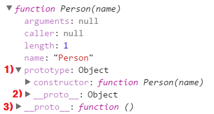

# 객체

## 생성자
JavaScript 에서 객체를 생성하는 방법에 대해 ['리터럴'](./04-datastructure.ko-KR.md#object) 방식을 앞서 설명했었다.  
그러나 JavaScript 에서는 객체를 생성하는 방법은 그 뿐만 아니라 한 가지 더 존재한다.  
바로 **생성자 함수** 를 이용하여 객체를 생성하는 것이다.

JavaScript 에서의 생성자는 C++이나, 자바와 같은 객체지향 언어에서의 생성자와는 다르게 어떤 형식이 정해져 있지 않다.  
그냥 **기존 함수에 new 연산자를 붙여서 호출하면 해당 함수는 생성자로 동작한다.**

```js
function Person(name) {
	this.name = name;
}

var my = new Person('ryum');
```

이는 반대로 생각하면 일반 함수에 new를 붙여 호출하면 원치 않는 생성자가 동작 할 수 있다는 점이다.  
따라서 대부분의 JavaScript 스타일 가이드에서는 특정 함수가 생성자 함수로 사용되는 함수라면,  
**함수의 이름 첫 글자를 대문자로 쓰기**를 권하고 있다.

## 객체 원형
JavaScript 객체들은 각각 객체 원형이 존재한다.  
이런 객체 원형들을 JavaScript 에서는 **Prototype (프로토타입)** 이라는 특별한 객체로 구분한다.

따라서 모든 객체들은 내부에 프로토타입이 존재하고,  
해당 프로토타입을 사용할 수 있다.

## 프로토타입
프로토타입 또한 객체이다.  
따라서 프로토타입 내부에도 프로퍼티나, 메소드들이 존재한다.

다음은 내장 객체 중 String 에 존재하는 프로토타입이다.  
```js
console.log(String.prototype);
// indexOf, concat, valueOf ... 등등
```

이러한 프로토타입 안에 존재하는 프로퍼티나, 메소드들을  
해당 프로토타입을 가지고 있는 객체들이 사용할 수 있는 것이다.
```js
var str = new String('string');
str.indexOf('s');		// 0
str.concat(' concat');	// string concat
```

그리고 앞서 [데이터 구조 - 래퍼 객체](./04-datastructure.ko-KR.md#래퍼-객체-wrapper-object)에서 설명한 바와 같이  
객체가 아닌, 기본 형식의 값들 또한 매핑되는 래퍼 객체에 존재하는 프로토타입을 사용할 수 있다.
```js
var str = 'string';
str.indexOf('s');		// 0
str.concat(' concat');	// string concat
```

또한 프로토타입에는 임의로 프로퍼티나, 메소드를 추가할 수도 있다.
```js
Object.prototype.func = function() {
	console.log('Object Prototype Custom Function');
}

Object.prototype.const = 'Object Prototype Custom Const';

var obj = {};
obj.func();					// Object Prototype Custom Function
console.log(obj.const;);	// Object Ptototype Custom Const
```

## 프로토타입 동작 방식
그렇다면 JavaScript 에서 이런 프로토타입이 어떻게 동작하는걸까  
좀 더 자세하게 알아보자.

먼저 다음 결과를 보자.
```js
function Person(name) {
	this.name = name;
}

console.dir(Person);		// Person 함수 자체를 출력
```

`실행 결과`  


### prototype 프로퍼티
먼저 위에 실행 결과 중 **1번**에 `prototype` 프로퍼티가 존재하는 것을 볼 수있다.  
이 프로퍼티는 함수가 선언되는 순간 생성되며  
생성된 함수와, 함수 자체가 서로를 가리키게 된다.  
이때 함수 입장에서 생성된 prototype 객체를 가리키는 것이 `prototype` 프로퍼티이며,  
생성된 prototype 객체 입장에선 함수 자체를 가리키는 것이 `constructor` 프로퍼티이다.

단, 이 `prototype` 프로퍼티는 해당 함수를 `new` 를 이용해 생성자 함수로 사용했을때 의미가 있다. *(예외도 있음)*  
만약 함수를 `new` 를 이용해 생성자 함수로 사용하게 되면  
함수 선언시 생성된 `prototype` 프로퍼티가 새로 생성된 객체와 연결되는 것이다.  
이때 새로 생성된 객체 입장에서 사용되는 프로퍼티는 `__proto__` 이다.
```js
var my = new Person('ryum');

console.log( my.__proto__ === Person.prototype );		// true
```

따라서 Person.prototype 에 임의로 프로퍼티나, 메소드를 추가하면  
Person 을 생성자 함수로 생성한 객체에서 사용할 수 있는 것이다.

### \_\_proto\__ 프로퍼티
다시 위로 올라가서, 2번과, 3번 둘다 `__proto__` 프로퍼티가 존재하는 것을 볼 수있다.  
먼저 `prototype` 프로퍼티 내부에 존재하는 2번은 **Person 객체의 상위 객체 prototype** 이다.  
여기서는 Person 의 상위 객체를 따로 지정하지 않았으므로, Object 의 prototype이 된다.
```js
console.log( Person.prototype.__proto__ === Object.prototype );		// true
```
이렇게 상위 객체가 따로 지정이 되지 않는 이상 무조건 `Object` 객체가 상위 객체가 된다.

> **Object**  
> 모든 객체의 최상위 객체는 Object 이다.

다음으로 바깥쪽에 있는 3번 `__proto__` 프로퍼티는  
JavaScript에서 함수 또한 객체로 표현된다는 것을 이해하면 알 수 있을 것이다.  
위에서 설명했던것으로, 함수라는 객체를 생성할 때 함수 객체가 연결되는 prototype 객체이다.

JavaScript 에서의 이러한 함수 자체를 생성할 때 사용하는 객체는 `Function` 객체로 지정되어있다.  
따라서 3번의 `__proto__` 는 Function.prototype 이다.
```js
console.log( Person.__proto__ === Function.prototype );		// true
```

> **Function**  
> 모든 함수의 상위 객체는 Function 이다.

---
|[prev](./08-function.ko-KR.md)|[content](./00-contents.ko-KR.md)|[next](./10-this.ko-KR.md)|
|:--:|:--:|:--:|